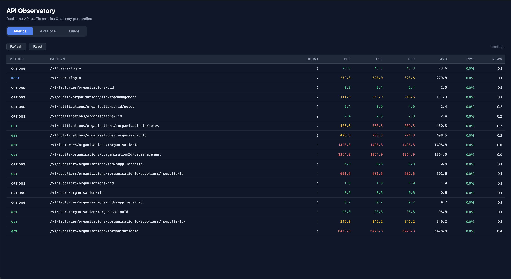
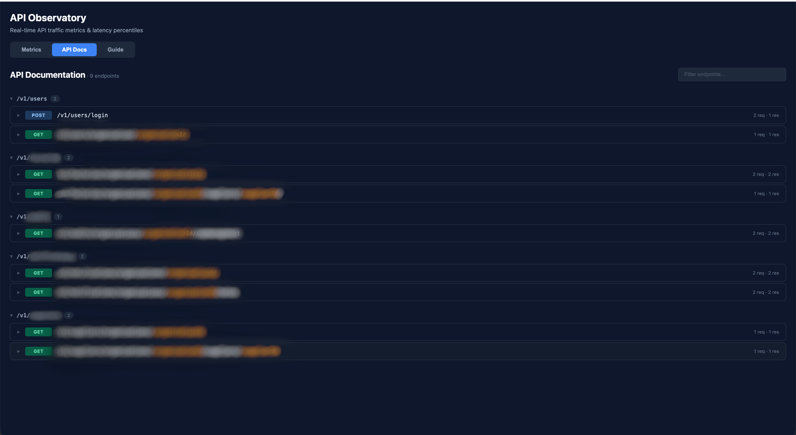
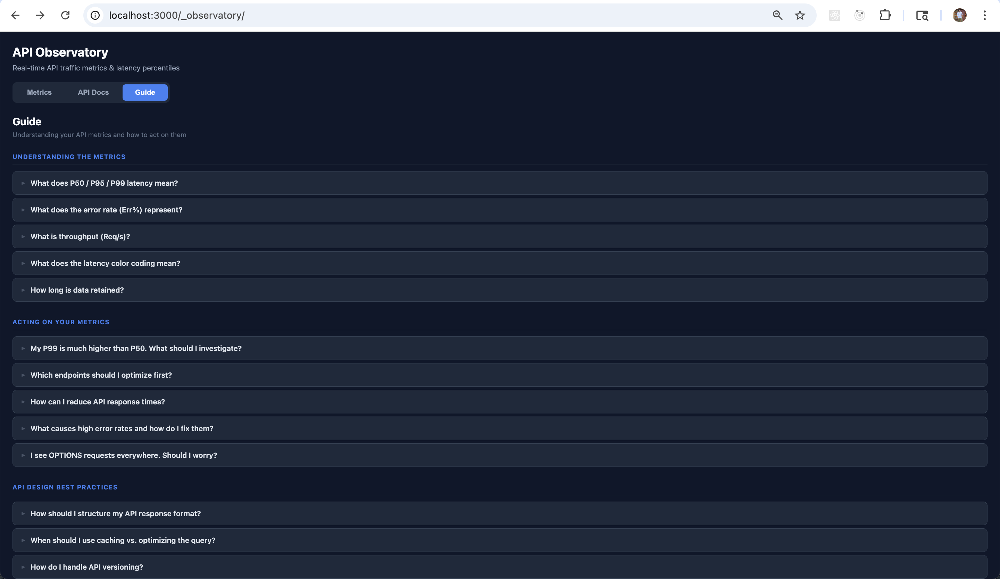

<p align="center">
  <h1 align="center">API Observatory</h1>
  <p align="center">
    Real-time API traffic metrics, latency percentiles, and auto-generated API documentation for Node.js.
    <br />
    Drop-in middleware for <strong>Express</strong>, <strong>Fastify</strong>, and <strong>Koa</strong> — zero dependencies, zero config.
  </p>
</p>

<p align="center">
  <a href="https://www.npmjs.com/package/api-observatory"></a>
  <a href="https://www.npmjs.com/package/api-observatory"></a>
  <a href="https://github.com/thisismayank/api-observatory/blob/master/LICENSE"></a>
  
  = 18" />
</p>

---

Add two lines of code. Get a full metrics dashboard, auto-generated API docs, and an interactive guide — all served from your running app at `/_observatory`.

## What You Get

### Metrics Dashboard

See every endpoint's request count, P50/P95/P99 latency, error rates, and throughput at a glance. Latency values are color-coded (green/yellow/red) so you can spot slow endpoints instantly.

<p align="center">
  
</p>

### Auto-Generated API Docs

Enable schema capture and API Observatory builds Swagger-like documentation from your live traffic — no manual spec writing needed. Endpoints are grouped by path prefix, path parameters are highlighted, and request/response schemas are inferred automatically.

<p align="center">
  
</p>

### Interactive Guide

A built-in reference explaining what each metric means, how to act on them, and API design best practices — right inside your dashboard.

<p align="center">
  
</p>

## Why API Observatory?

| | |
|---|---|
| **Zero dependencies** | No runtime dependencies. Nothing to audit, nothing to break. |
| **Zero config** | Works out of the box with sensible defaults. |
| **Off the hot path** | Metrics are recorded via `setImmediate()` — your response times stay the same. |
| **Fixed memory** | Circular buffer storage with automatic eviction. No memory leaks. |
| **Three frameworks** | Express, Fastify, and Koa adapters with identical feature sets. |
| **Schema inference** | Auto-generates API docs from live traffic — no OpenAPI spec required. |

## Quick Start

```bash
npm install api-observatory
```

### Express

```js
import express from 'express';
import { expressObservatory } from 'api-observatory';

const app = express();
app.use(expressObservatory()); // Mount FIRST
app.use(express.json());
// ... your routes
app.listen(3000);
```

### Fastify

```js
import Fastify from 'fastify';
import { fastifyObservatory } from 'api-observatory';

const app = Fastify();
app.register(fastifyObservatory);
// ... your routes
app.listen({ port: 3000 });
```

### Koa

```js
import Koa from 'koa';
import { koaObservatory } from 'api-observatory';

const app = new Koa();
app.use(koaObservatory()); // Mount FIRST
// ... your routes
app.listen(3000);
```

Then open **http://localhost:3000/_observatory** in your browser.

## Schema Capture (API Docs)

Schema capture intercepts request and response bodies to build inferred JSON schemas from live traffic. Enable it to get the API Docs tab.

**In code:**
```js
app.use(expressObservatory({ captureSchemas: true }));
```

**Or via environment variable:**
```
OBSERVATORY_CAPTURE_SCHEMAS=true
```

### How it works

1. Request bodies are captured from `req.body` (requires a body parser)
2. Response bodies are captured by intercepting `res.json()` / `onSend` hook / `ctx.body`
3. Schemas are inferred recursively from each observed body
4. Repeated observations are merged — fields present in every request are marked `required`, others `optional`
5. Type conflicts are widened (e.g., `string | number`)

All schema processing runs off the hot path via `setImmediate()`. It does **not** block responses. For high-throughput production APIs with large payloads, consider enabling it only in staging/development.

> **Important:** Mount the middleware **once**. Multiple instances have isolated stores, so data will be split and the dashboard will only show partial data.

## Configuration

All options are optional.

```js
app.use(expressObservatory({
  mountPath: '/_observatory',        // Dashboard URL path
  includePaths: ['/api/**'],         // Only track these routes (glob)
  excludePaths: ['/health'],         // Skip these routes (glob)
  retentionMs: 3_600_000,           // 1 hour retention window
  maxPerEndpoint: 10_000,           // Circular buffer capacity
  percentiles: [50, 95, 99],        // Which percentiles to compute
  htmlDashboard: true,              // Serve HTML (false = JSON only)
  captureSchemas: true,             // Enable schema inference
  onRecord: (record) => { ... },    // Forward to external systems
}));
```

| Option | Type | Default | Description |
|--------|------|---------|-------------|
| `mountPath` | `string` | `/_observatory` | Dashboard URL path |
| `includePaths` | `string[]` | `[]` | Glob patterns to track (empty = all) |
| `excludePaths` | `string[]` | `[mountPath, ...]` | Glob patterns to skip |
| `retentionMs` | `number` | `3_600_000` | Metrics retention window (ms) |
| `maxPerEndpoint` | `number` | `10_000` | Max records per endpoint |
| `percentiles` | `number[]` | `[50, 95, 99]` | Percentiles to compute |
| `htmlDashboard` | `boolean` | `true` | Serve HTML dashboard |
| `captureSchemas` | `boolean` | `false` | Enable schema capture |
| `onRecord` | `function` | — | Callback after each record |

| Environment Variable | Description |
|---------------------|-------------|
| `OBSERVATORY_CAPTURE_SCHEMAS` | Set to `true` to enable schema capture without code changes |

## API Endpoints

| Method | Path | Description |
|--------|------|-------------|
| `GET` | `/_observatory` | HTML dashboard (or JSON if `htmlDashboard: false`) |
| `GET` | `/_observatory/metrics` | All endpoint metrics as JSON |
| `GET` | `/_observatory/metrics/:method/*` | Single endpoint metrics |
| `GET` | `/_observatory/schemas` | All captured schemas as JSON |
| `GET` | `/_observatory/schemas/:method/*` | Single endpoint schema |
| `POST` | `/_observatory/reset` | Clear all metrics and schemas |

## Route Extraction

API Observatory automatically extracts parameterized route patterns (e.g., `/v1/users/:id`) instead of raw URLs. When route info is unavailable, it normalizes paths by replacing UUIDs, ObjectIds, and numeric IDs with `:id`.

| Framework | Source |
|-----------|--------|
| Express | `req.baseUrl + req.route.path` |
| Fastify | `request.routeOptions.url` |
| Koa | `ctx._matchedRoute` |

## Requirements

- Node.js >= 18
- Express >= 4, Fastify >= 4, or Koa >= 2 (peer dependencies, all optional)

## License

MIT
